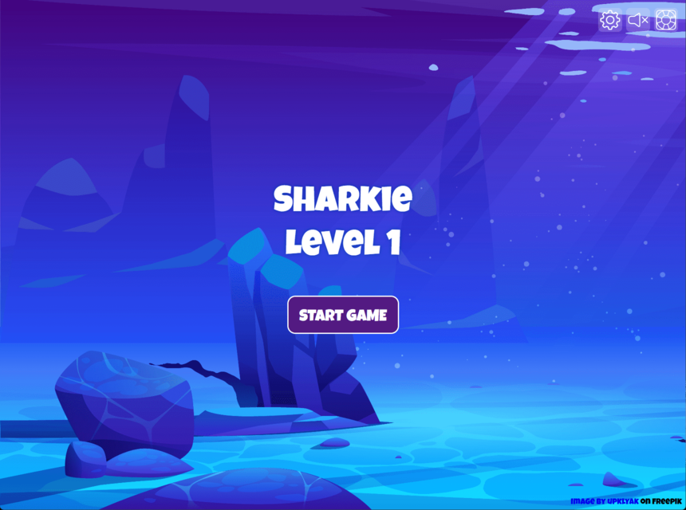
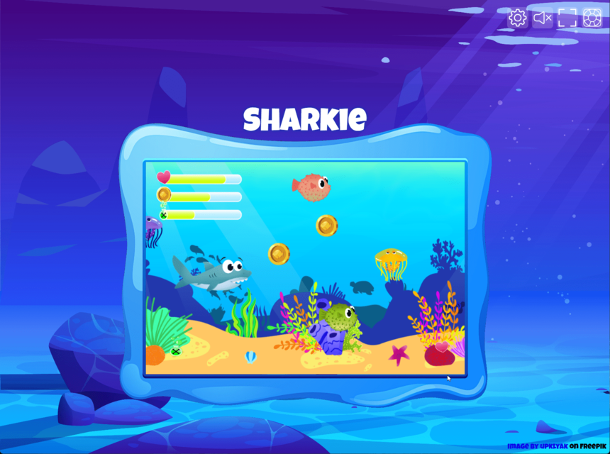
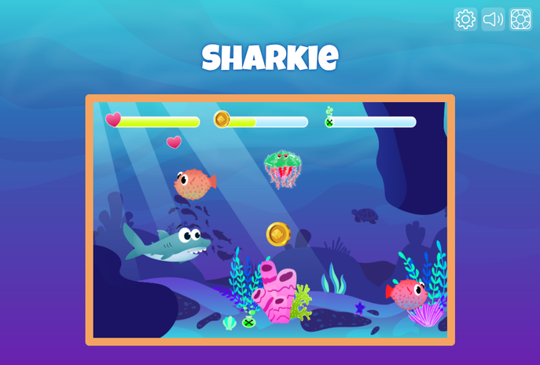
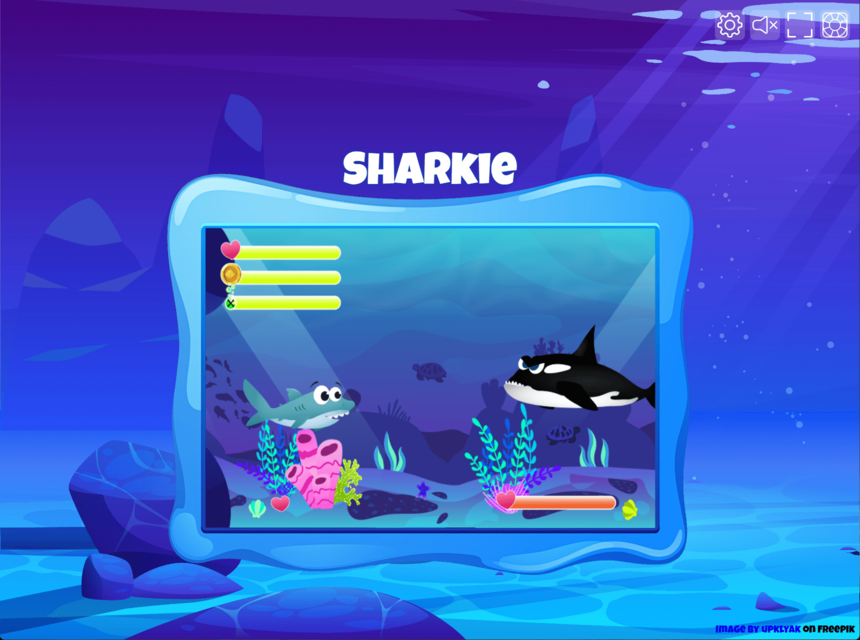
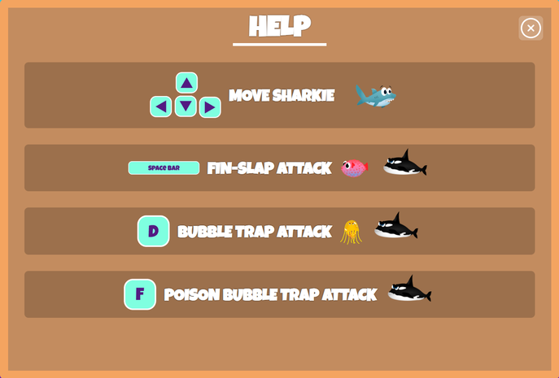

<h1>Sharkie</h1> 
Sharkie is a small browser game to learn the concept and basic knowledge of object orientation in JavaScript. It is a project of the frontend web developer course at the <a href="https://developerakademie.com/">Developer Akademie</a>. 

<b>IMPORTANT:</b> Please note that learning projects focus on the given tasks. It is therefore possible that some functions do not work or are not scripted.
<h3>Table of Contents</h3>

- <a href="#features">Features</a>
- <a href="#known-issues-and-todo">Known issues & Todo</a>
- <a href="#preview">Preview</a>
- <a href="#installation">Installation</a>
- <a href="#license">License</a>

<h2 id="features">Features</h2>
Here is an overview of the most important functions of the project. Click on the summary to expand. 

 

<b>Available Languages</b>

  
:ballot_box_with_check: English  
  

<b>Functionality</b>

  
:ballot_box_with_check: Control Sharkie through the underwater world with the arrow keys  
:ballot_box_with_check: Collect coins, poison and life  
:ballot_box_with_check: Fight against puffer fish, jellyfish and the final boss  
:ballot_box_with_check: Use the spacebar to use the Fin-Slap attack on puffer fish and the final boss  
:ballot_box_with_check: Use the F-key to use the normal Bubble Trap attack on jellyfish and the final boss  
:ballot_box_with_check: Use the poisonous Bubble Trap attack by picking up poison and then using it on the enboss  
:ballot_box_with_check: Many things can be adjusted in the settings menu  
:ballot_box_with_check: With the level design helper, new levels can be easily designed  
:ballot_box_with_check: Mute/Unmute function is accessible in the settings menu and during the game via the icons  
:ballot_box_with_check: There is a game help that can be displayed by clicking on the lifebelt 
  

<h2 id="known-issues-and-todo">Known issues & Todo</h2>
This is an overview of the already known problems and bugs as well as a collection of things that still need to be done. 

 

<b>Known issues</b>

:lady_beetle:	It is possible to glitch into the barriers with Sharkie and then get stuck  
:lady_beetle:	On a special attack on the final boss and when he dies, the death animation will repeat indefinitely  
:lady_beetle:	Coin collecting sound does not restart when a new coin is picked up in close succession   
:lady_beetle: Setting the full screen is currently only possible when the game has started

<b>Todo</b>

:white_large_square: Add better sounds for Sharkie swimming for example  
:white_large_square: Implement game pause function  

<h2 id="preview">Preview</h2>

---

---

---

---

---

<h2 id="installation">Installation</h2>
Follow these steps to install/test the project.

<h3 id="requirements">1. Requirements</h3>
All you need is a web browser like one of the following:
 
 

<h3>2. Download the Source</h3>
Download the source code or clone the repository on your local computer by clicking the <b>Code</b> button.
 
 

<h3>3. Start the Project</h3>
Navigate to the location on your computer where you downloaded/cloned the code. In the project directory, open the <b>index.html</b> file with a web browser.
 
 

 
index.html

<h2 id="license">License</h2>

All game graphics are property of the <a href="https://developerakademie.com/">Developer Akademie</a>. The graphics are left to the participants of the course for learning purposes for use in the projects and are subject to the copyright of the <a href="https://developerakademie.com/">Developer Akademie</a>.

The source code is subject to the following license:

